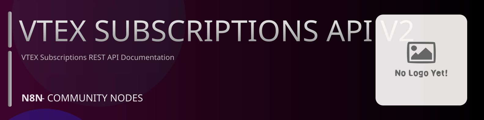

# @n8n-dev/n8n-nodes-vtex-subscriptions-api-v2



[](https://www.npmjs.com/package/@n8n-dev/n8n-nodes-vtex-subscriptions-api-v2)
[](https://opensource.org/licenses/MIT)

---

**Stop writing vtex-subscriptions-api-v2 API integrations by hand.**

Every time you connect n8n to vtex-subscriptions-api-v2, you waste hours mapping endpoints, defining parameters, and debugging schemas. You copy-paste from docs, fix edge cases, and pray nothing breaks.

**What if connecting n8n to vtex-subscriptions-api-v2 took 5 minutes, not half a day?**

This node gives you **4+ resources** out of the box: **Subscriptions**, **Subscription Group**, **Report**, **Settings**: with full CRUD operations, typed parameters, and zero manual configuration.

---

## What You Get

- **Zero boilerplate**: Resources, operations, and fields are pre-configured and ready to use
- **Full CRUD**: Create, read, update, and delete support where the API allows it
- **Typed parameters**: No more guessing field types
- **Built-in auth**: API key authentication, ready to go
- **Declarative**: Native n8n performance, no custom execute() overhead

---

## Install

```bash
npm install @n8n-dev/n8n-nodes-vtex-subscriptions-api-v2
```

**Or in n8n:**
1. **Settings → Community Nodes → Install**
2. Search: `@n8n-dev/n8n-nodes-vtex-subscriptions-api-v2`
3. Click **Install**

---

## Quick Start

1. Install the node (above)
2. Add credentials: **vtex-subscriptions-api-v2 API** → paste your API key
3. Drag the **vtex-subscriptions-api-v2** node into your workflow
4. Pick a resource → pick an operation → done.

That's it. No configuration files. No code. It just works.

---

## Resources

| Resource | Operations |
|----------|------------|
| Subscriptions | Get retrieve customers subscriptions, Get subscription list, Get retrieve subscription by id, Patch update subscriptions by subscriptionid, Post insert addresses for subscription, Patch cancel subscriptions by subscriptionid, Get frequency options by subscriptionid |
| Subscription Group | Get list all subscription groups, Get subscription group list, Get next purchase, Get simulation by subscriptiongroup, Get subscription by groupid, Patch update subscription by groupid, Post add subscription item by groupid, Get addresses by groupid, Post insert addresses by groupid, Patch cancel subscription by groupid, Get list subscription groups configuration, Get conversation message by groupid, Get frequency options by groupid, Get payment system by groupid, Get list will create by groupid, Post retry subscription by groupid |
| Report | Get report status by id, Get retrieve subscription report by date, Get retrieve subscription report by status, Get retrieve subscription report by order date, Get retrieve subscription report by schedule, Get request report by update |
| Settings | Get subscriptions settings, Post edit subscriptions settings |

---

## Why This Node?

**Without this node:**
- Hours of manual API integration
- Copy-pasting from vtex-subscriptions-api-v2 docs
- Debugging auth, pagination, error handling
- Maintaining your own client code

**With this node:**
- Install → configure → use. 5 minutes.
- Auto-generated from the official vtex-subscriptions-api-v2 OpenAPI spec
- Always up to date when the API changes
- Native n8n performance

---

## Auto-Generated
This node was auto-generated from the official **vtex-subscriptions-api-v2** OpenAPI specification using
[@n8n-dev/n8n-openapi-node-ultimate](https://github.com/kelvinzer0/n8n-openapi-node-ultimate),
then validated against the live API so you get accurate types and real parameters, not guesswork.

When the vtex-subscriptions-api-v2 API updates, this node updates too.

---

## Support This Project

If this node saved you hours of work, consider supporting continued development, new APIs, better error handling, and faster updates.

[](https://n8n-code.github.io/membership/#/eyJ0aXRsZSI6IktlZXAgSXQgTW92aW5nIiwiZGVzYyI6Ik9uZSBkZXZlbG9wZXIgYnVpbHQgYSB0b29sIHRoYXQgYXV0by1nZW5lcmF0ZXNcbm44biBub2RlcyBmcm9tIGFueSBPcGVuQVBJIHNwZWMuXG5cbllvdXIgZG9uYXRpb24gZnVuZHMgbmV3IGZlYXR1cmVzLCBtb3JlIEFQSSBzdXBwb3J0LFxuYW5kIGJldHRlciB0b29saW5nIGZvciBldmVyeSBkZXZlbG9wZXIgYWZ0ZXIgeW91LiIsInRhcmdldCI6NTAwMCwiYWRkcmVzc2VzIjp7ImV0aGVyZXVtIjoiMHhmMDU1NWQ0MGRiRkI0ZTNCZjA3MDQ0MjgyQjc4RjJmRTFmNTFFZjcyIiwic29sYW5hIjoiNlpEVk5BYmpZZExEcXo4cGt3VUNHYllaNVV3QlFranB0QzU1Wk5vTFcybVUifSwiZGlzY29yZCI6Imh0dHBzOi8vZGlzY29yZC5nZy9wdERaOGU0aDkzIn0)

---

## License

MIT © [kelvinzer0](https://github.com/n8n-code)
